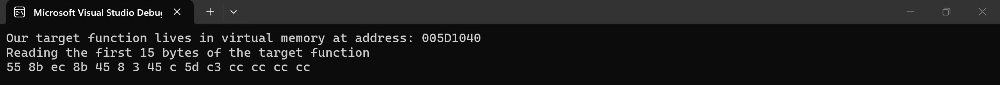
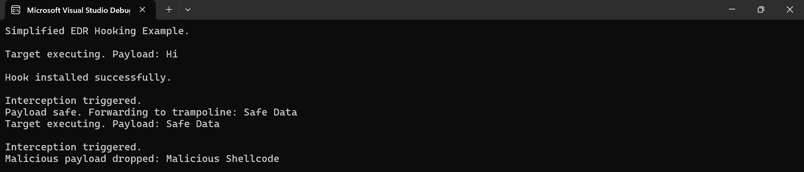
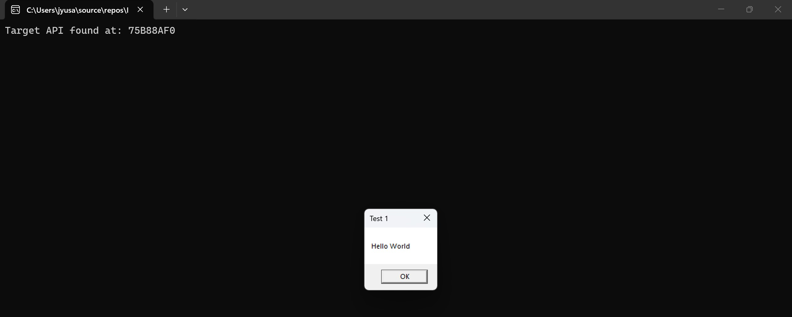
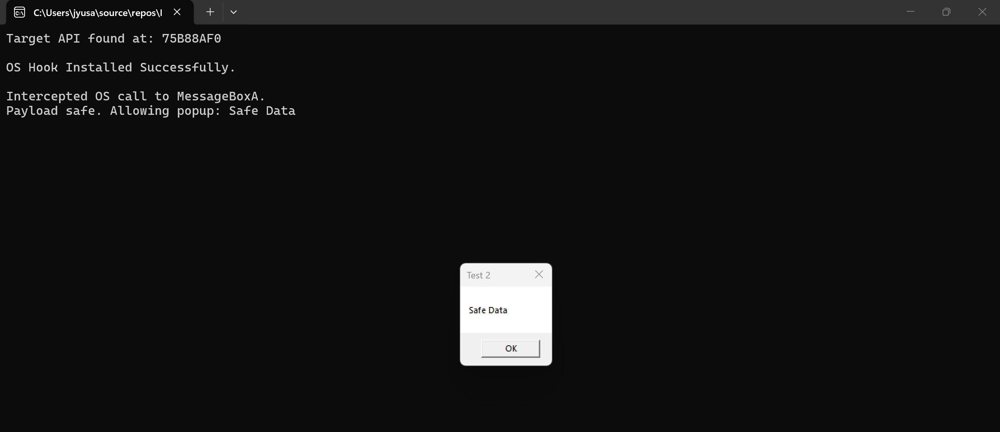
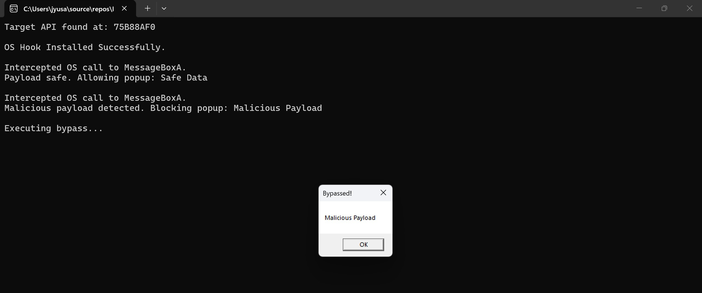

# Build and Bypass EDR: API Hooking and Evasion

## Introduction & Motivation
This project documents my learnings on how Endpoint Detection and Response (EDR) sensors monitor application behavior and how evasive malware attempts to bypass these mechanisms.

I wanted to apply the concepts I learned in my recent computer systems course (shoutout CS300!) to topics more focused on cybersecurity, while also reinforcing my programming skills by building a project from scratch in C++ (x86). My main goal was to explore and understand the low-level memory interactions and the raw assembly mechanics required to manipulate process execution flow. The project is separated into three distinct phases.

## 1. Functions as Raw Memory (`MemoryDemo.cpp`)
A brief refresher on one of the core concepts that I learned in my course: **Everything is bytes!** I needed to view functions as sequential bytes of machine code, living within the virtual memory of a process.

In `MemoryDemo.cpp`, I wrote a basic `target()` function that adds two integers. I wanted to locate this function in memory and read its bytes. I cast the function's execution address into a `void*`, then into an `unsigned char*` for smooth pointer arithmetic. After that, by treating the function address as an array (**Pointer/Array Duality!**), I iterated through the first 15 bytes of the function and printed their hexadecimal values to the console.

Executable code is just data residing in memory. If we can read these bytes and acquire the right permissions, we can overwrite them.

## 2. Proof of Concept: EDR Hooking (`EDRConcept.cpp`)
Since we can read memory, the next step was to simulate an EDR sensor by intercepting a function call. To achieve this, I decided to learn about and implement an inline hook.

I wrote a `proxy()` function and needed a way to forcibly redirect the program's execution flow from the original `target()` function to it.

I learned that by default, Windows protects executable memory pages. Using the `VirtualProtect` function, I was able to change the memory page permissions to `PAGE_EXECUTE_READWRITE`, which allowed me to modify the function's bytes. With that taken care of, I overwrote the first 5 bytes of the target function with an x86 `JMP` instruction (`0xE9`). To make the CPU jump exactly to the proxy function, some math was required. I implemented this by calculating:

$$Offset = Destination - Source - 5$$

One major challenge I encountered here was figuring out exactly how many bytes to take for the trampoline. I initially tried taking exactly 5 bytes (the size of our `JMP` instruction), but because x86 instructions are variable in length, this cut a multi-byte assembly instruction in half after the program was compiled. When the trampoline tried to execute the bytes, the CPU crashed. By analyzing the raw assembly, I figured out I needed to copy exactly 8 bytes to reach a clean boundary.

If the proxy decides a payload is safe, it needs to hop on a trampoline to resume normal execution. I allocated new executable memory using `VirtualAlloc`, copied the original stolen bytes into it, and then appended a jump back to the original function (offset by 5 bytes).

The proxy successfully intercepted standard calls and inspected the string payloads. Malicious payloads were blocked and safe inputs were forwarded to the trampoline to seamlessly continue regular execution. 

## 3. Hooking Windows & Evasion (`WinEDRx86.cpp`)
Finally, I transitioned from hooking a custom function to an actual Windows OS function (`MessageBoxA` in `user32.dll`), then used the same concepts I learned so far to go the other way, building an offensive bypass to defeat my own sensor.

### Step 1: The OS EDR Sensor
I used the `GetModuleHandleA` and `GetProcAddress` functions to locate `MessageBoxA` in virtual memory. Then, I transferred over the trampoline hook from the last section onto `MessageBoxA`. When the program attempted to launch a message box containing "Malicious Payload," the proxy function successfully intercepted the OS call and killed it.

### Step 2: The Evasion (`execute_bypass` function)
Now, with the setup done, I wanted to simulate what an attacker would do against my protections. My goal was to execute `MessageBoxA` with the malicious payload without triggering the proxy and crashing the process. Simply "unhooking" the API wouldn't work, as a real EDR would flag that memory reversion.

Instead, I decided to rebuild a clean and unhooked version of the API in a new memory space. First, I used `VirtualAlloc` to create a new evasion trampoline (`bye_trampoline`). After discovering that standard Windows APIs use a predictable 5-byte hotpatch prologue, I manually wrote those assembly bytes directly into the newly allocated memory:

*   `0x8B 0xFF` (`mov edi, edi`)
*   `0x55` (`push ebp`)
*   `0x8B 0xEC` (`mov ebp, esp`)

Right after the prologue, I calculated a new relative jump instruction. This jump was designed to leap directly into the original API, landing exactly at byte 6, which would smoothly bypass the EDR's 5-byte trap. Finally, I cast the evasion trampoline into a callable function pointer and passed my malicious arguments into it.

The program successfully bypassed the memory hook, passing the malicious payload directly to the operating system without detection.

## 4. Static Binary Analysis/Reverse Engineering (Ghidra)

At this point, with the completed program, I wanted to truly understand what my program was doing and verify that my logic was manipulating memory correctly. To also introduce myself to binary analysis and reverse engineering, I imported the final compiled executable into Ghidra to analyze the raw x86 assembly.

In the decompiled view of `trampoline_hook`, I successfully found and traced the `VirtualProtect` API call. I could see that it was passing `0x40` (hex value for `PAGE_EXECUTE_READWRITE`) to unlock the memory page, then being assigned the `0xE9` (`JMP`) opcode.

Now, looking at the assembly for the evasion trampoline in `execute_bypass`, I saw `0xE9` (`JMP`) being written again to execute the jump over the sensor, but I also located the exact memory address where the compiler translated my C++ algebra ($Destination - Source - 5$) into CPU instructions. I was able to see the specific `MOV` and `SUB` hardware register commands used to calculate the 32-bit relative distance.

While C++ abstracts memory management, static analysis reveals the absolute truth of what the CPU is executing. Seeing the exact assembly bytes my code injected into the process memory solidified my understanding of how EDRs and malware manipulate execution flow at the bare-metal level.

## Conclusion

Ever since taking my first computer systems course, I've been interested in looking at how programs and applications operate at a low level, down to its bytes in memory. in This project bridged the gap between high-level C++ programming and low-level reverse engineering. By building both the sensor and the evasion mechanics by hand, I gained a profound appreciation for Windows memory architecture, process isolation, and the continuous cat-and-mouse game between threat actors and cybersecurity defenses.
