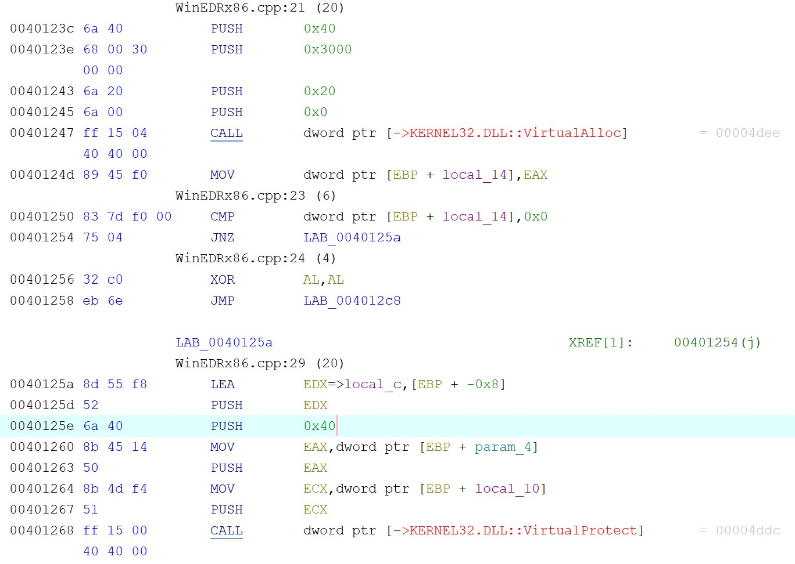
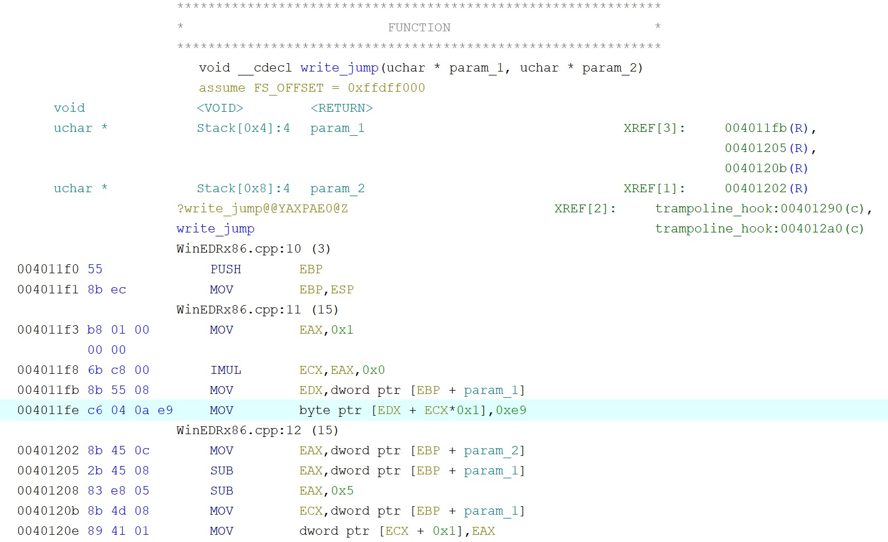
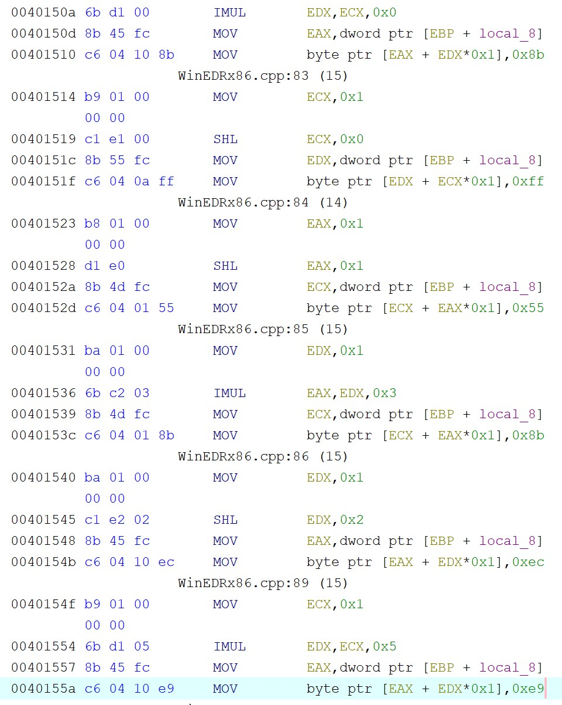
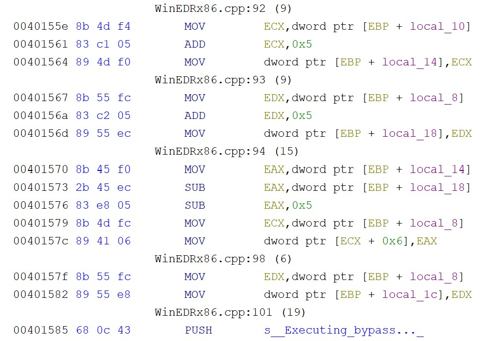

# Build and Bypass EDR: API Hooking and Evasion

## Introduction & Motivation
This project explores how Endpoint Detection and Response (EDR) sensors monitor applications and how malware bypasses them through the process of replicating and building both mechanisms from scratch.

I wanted to apply the concepts I learned in my recent computer systems course (shoutout CS300!) to topics more focused on cybersecurity, while also reinforcing my programming skills by building a project from scratch in C++ (x86). My main goal was to explore and better understand the low-level memory interactions and the raw assembly mechanics required to manipulate process execution flow. The project is separated into four distinct phases.

### Technologies & Tools Used
*   **Languages:** C++, x86 Assembly
*   **Environment:** Windows OS, Windows API (Win32 API)
*   **Tools:** Visual Studio (MSVC Compiler), Ghidra (Static Analysis & Reverse Engineering)

## 1. Functions in Memory (`MemoryDemo.cpp`)
A brief refresher on one of the core concepts that I learned in my course: **Everything is bytes!** I needed to view functions as bytes of machine code residing within the virtual memory of a process.

In `MemoryDemo.cpp`, I wrote a basic `target()` function that adds two integers. I wanted to locate this function in memory and read its bytes. I cast the function's execution address into a `void*`, then into an `unsigned char*` for smooth pointer arithmetic. After that, by treating the function address as an array (**Pointer/Array Duality!**), I iterated through the first 15 bytes of the function and printed their hexadecimal values to the console.

Executable code is just data living in memory. If we can read these bytes and acquire the right permissions, we can overwrite them.

## 2. Proof of Concept: EDR Hooking (`EDRConcept.cpp`)
Since we can read memory, the next step was to simulate an EDR sensor by intercepting a function call. After doing some research, I found a technique called 'inline hooking' that was used to achieve this. I decided to implement it.

I wrote a `proxy()` function and needed a way to redirect the program's execution flow from the original `target()` function to it. If the proxy decides a payload is safe, the program should resume normal execution. For this to work, the original bytes we overwrite has to be saved somewhere else in memory, creating a 'trampoline' that executes the stolen instructions and then jumps back to the location of the remaining instructions of the original function, allowing the function call to complete.

I learned that by default, Windows protects executable memory pages. With the `VirtualProtect` function, I was able to change the memory page permissions to `PAGE_EXECUTE_READWRITE`, which allowed me to modify the function's bytes. With that taken care of, I overwrote the first 5 bytes of the target function with an x86 `JMP` instruction (`0xE9`). To make the CPU jump exactly to the proxy function, I calculated $Offset = Destination - Source - 5$ and injected this value right next to the jump instruction.

One major challenge I encountered here was figuring out exactly how many bytes to take for the trampoline. I initially tried taking exactly 5 bytes (the size of our `JMP` instruction), but because x86 instructions do not have fixed sizes, this cut a multi-byte assembly instruction in half after the program was compiled. When the trampoline tried to execute the bytes, the CPU crashed. By analyzing the raw assembly, I figured out I needed to copy exactly 8 bytes to reach a clean boundary.

With this issue solved, I allocated new executable memory using `VirtualAlloc`, copied the original stolen bytes into it, and then appended a jump back to the original function (offset by 5 bytes).

The proxy successfully intercepted standard calls and inspected the string payloads. Malicious payloads were blocked and safe inputs were forwarded to the trampoline to seamlessly continue regular execution. 

## 3. Hooking Windows & Evasion (`WinEDRx86.cpp`)
Finally, I transitioned from hooking a custom function to an actual Windows OS function (`MessageBoxA` in `user32.dll`), then applied same concepts I've learned so far from an attacker's perspective to build an offensive bypass to stump my own sensor.

### Step 1: The OS EDR Sensor
I used the `GetModuleHandleA` and `GetProcAddress` functions to locate `MessageBoxA` in virtual memory. Then, I transferred over the trampoline hook from the last section onto `MessageBoxA`. When the program attempted to launch a message box containing "Malicious Payload," the proxy function successfully intercepted the OS call and killed it.

### Step 2: The Evasion (`execute_bypass` function)
Now, with the setup done, I wanted to simulate what an attacker would do against my protections. My goal was to execute `MessageBoxA` with the malicious payload without triggering the proxy and crashing the process. Simply unhooking the API wouldn't work, as a real EDR would flag it.

Instead, I decided to rebuild a clean and unhooked version of the API in a new memory location. First, I used `VirtualAlloc` to create a new trampoline for evasion (`bye_trampoline`). After discovering that standard Windows APIs use a predictable 5-byte hotpatch prologue, I manually wrote those assembly bytes directly into the newly allocated memory:

*   `0x8B 0xFF` (`mov edi, edi`)
*   `0x55` (`push ebp`)
*   `0x8B 0xEC` (`mov ebp, esp`)

Right after the prologue, I calculated a new relative jump instruction. This jump was designed to leap directly into the original API, landing exactly at byte 6, which would smoothly bypass the EDR's 5-byte trap. Finally, I cast the evasion trampoline into a callable function pointer and passed my malicious arguments into it.

The program successfully bypassed the memory hook, passing the malicious payload directly to the operating system without detection.

## 4. Static Binary Analysis/Reverse Engineering (Ghidra)
At this point the program was complete, but to truly understand what my program was doing and verify that my logic was manipulating memory correctly, I imported the final compiled executable into Ghidra to analyze the raw x86 assembly.

In the raw assembly of `trampoline_hook`, I successfully found and traced the `VirtualProtect` API call. I could see that it was passing `0x40` (hex value for `PAGE_EXECUTE_READWRITE`) to unlock the memory page, then being assigned the `0xE9` (`JMP`) opcode.

Now, looking at the raw assembly for the evasion trampoline in `execute_bypass`, I could clearly see the reconstruction of the 5-byte hotpatch prologue, followed immediately by the `0xE9` (`JMP`) opcode being written again to execute the jump over the sensor.

Moving further down, I also located the exact memory address where the compiler translated the offset algebra ($Destination - Source - 5$) into CPU instructions. We can see the specific `MOV` and `SUB` instructions being used to calculate the 32-bit offset.

According to my logic, the program appeared to be working on the surface level when ran. However, static analysis revealed the bare bones truth of what the CPU was executing. Seeing exactly what my code was doing by analyzing the exact assembly bytes the program injected into memory and the instructions that was being performed was extremely rewarding.

## Conclusion

Recently, I took my first computer systems course. Ever since then, I've been interested in looking at how programs and applications operate at a low level, down to its bytes and assembly instructions. This project bridged a frustrating gap I felt between my lower-level computer science coursework from my degree and my interest in a career in cybersecurity. Building this entire project from scratch - developing both the sensor and the evasion mechanics, getting used to the Windows kernel API by reading documentation, and solidifying my understanding of low-level memory interactions - made me realize again why I'm constantly enthralled by the cybersecurity space. The game between attackers and defenders drives constant innovation and evolution, which means that for me, there will always be new things to learn and play with.

### Key Concepts Learned
*   **EDR Mechanics:** Intercepting and inspecting API calls via inline hooking.
*   **Malware Evasion Techniques:** Bypassing security hooks by manually reconstructing API hotpatch prologues and building offensive execution trampolines.
*   **Low-Level Memory Management:** Manipulating memory page permissions (e.g., `VirtualProtect`, `PAGE_EXECUTE_READWRITE`) and allocating executable virtual memory.
*   **x86 Assembly & CPU Execution:** Calculating relative jump offsets and navigating assembly instruction boundaries.
*   **Reverse Engineering:** Static binary analysis and reverse engineering with Ghidra.
